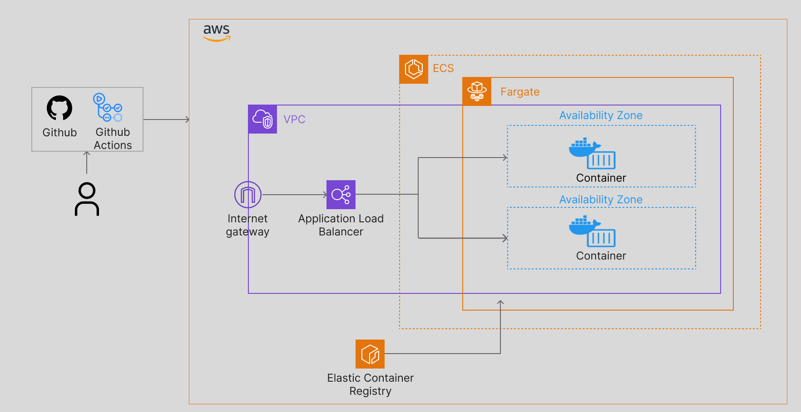

# SpringBoot 컨테이너 CI/CD 파이프라인 구축 

## 기술스택
- SpringBoot 3.2.5
- Java17
- Docker
- ECR
- ECS
- Git Actions

## 시스템 아키텍쳐

## 워크플로우 Steps

### 1. Checkout
- 레포지토리의 코드를 체크아웃합니다.

### 2. Configure AWS credentials 
- AWS 자격 증명을 설정합니다.

### 3. Login to Amazon ECR
- Amazon ECR에 로그인합니다.

### 4. Build, tag, and push image to Amazon ECR
- Docker 이미지를 빌드하고 태그한 다음 Amazon ECR에 푸시합니다.
- IMAGE_TAG는 현재 GitHub 커밋 SHA로 설정됩니다.
- 빌드된 이미지의 정보를 GitHub Actions의 출력으로 저장합니다.

### 5. Fill in the new image ID in the Amazon ECS task definition
- 새로운 이미지 ID로 ECS 태스크 정의를 업데이트합니다.

### 6. Deploy Amazon ECS task definition
- 업데이트된 태스크 정의를 ECS에 배포합니다.
- 배포된 서비스의 안정성을 확인할 때까지 기다립니다.

